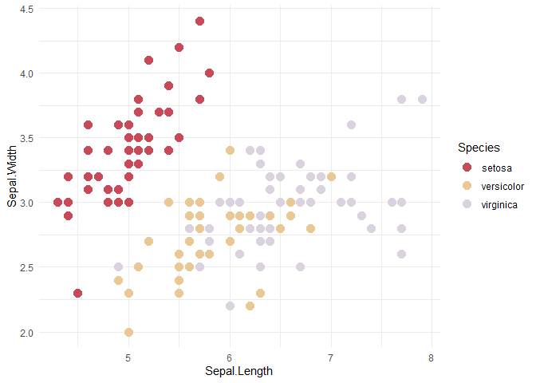

# nifutheme

<!-- badges: start -->
<!-- badges: end -->

Color palettes and ggplot2-integrated color scale functions based on
NIFU colors.

## Installation

Install nifutheme directly from GitHub like this:

``` r
# install.packages(remotes)  ## Run this command if you do not have the remotes package installed already

remotes::install_git("https://github.com/NIFU-NO/nifutheme")
```

## Usage

Currently, nifutheme makes available two functions that can be used in
ggplot2-plotting. Here is the color aesthetic:

``` r
# Required libraries
library(ggplot2)
library(nifutheme)

iris |> 
  ggplot(aes(x = Sepal.Length,
             y = Sepal.Width,
             color = Species)) +
  geom_point(size = 3.5) +
  scale_color_nifu() +
  theme_minimal()
```

<!-- -->

And here is the fill aesthetic. Note the arguments that specify
non-discrete data and a color specification:

``` r
faithfuld |> 
  ggplot(aes(x = waiting,
             y = eruptions,
             fill = density)) +
  geom_tile() +
  scale_fill_nifu(discrete = FALSE,
                  palette = "reds") +
  theme_minimal()
```

<!-- -->

Here is the fill aesthetic in the blue hues:

``` r
faithfuld |> 
  ggplot(aes(x = waiting,
             y = eruptions,
             fill = density)) +
  geom_tile() +
  scale_fill_nifu(discrete = FALSE,
                  palette = "blues") +
  theme_minimal()
```

<!-- -->

Palettes are reversible:

``` r
faithfuld |> 
  ggplot(aes(x = waiting,
             y = eruptions,
             fill = density)) +
  geom_tile() +
  scale_fill_nifu(discrete = FALSE,
                  palette = "blues",
                  reverse = TRUE) +
  theme_minimal()
```

<!-- -->
